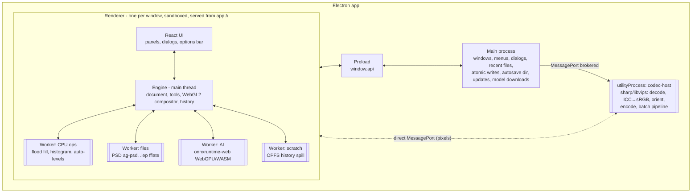
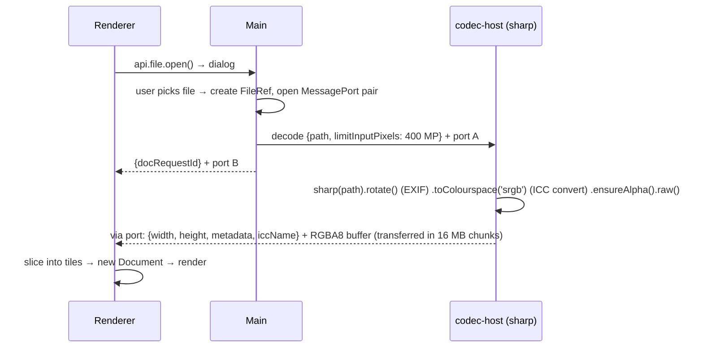

# 02 — Architecture: ImageEditor

| | |
| --- | --- |
| Status | Draft v0.1 |
| Last updated | 2026-09-27 |
| Related | [Requirements](01-requirements.md) · [IPC & Command API](04-ipc-command-api.md) · [Data Model](05-data-model.md) · [File Formats & Color](09-file-formats-color.md) · [ADRs](adr/) |

## 1. Architectural drivers

| Driver | Consequence |
| --- | --- |
| Smooth editing of large, many-layer documents (G2, NFR-PERF-*) | Sparse **tiled** document + **WebGL2** compositor + GPU brush/filters ([ADR-0003](adr/0003-tiled-document-webgl2-engine.md)) |
| Non-destructive editing and deep undo (G3) | Adjustment layers/masks evaluated at composite time. Command-based history over **immutable tiles** with disk spill ([ADR-0005](adr/0005-non-destructive-model-and-history.md)). |
| Untrusted image files | Decoders isolated in a utilityProcess (sharp) and workers (PSD, zip) ([ADR-0008](adr/0008-codec-host-utility-process.md)) |
| Private, offline AI | onnxruntime-web in a worker (WebGPU → WASM), models downloaded on demand ([ADR-0006](adr/0006-on-device-ai-models.md)) |
| Correct colour on phone/camera images | Convert to sRGB 8-bit on import, tag on export ([ADR-0004](adr/0004-colour-management-srgb-8bit.md)) |
| Same stack as the rest of the repo | Electron + electron-vite + React + TypeScript ([ADR-0002](adr/0002-app-stack-electron-react.md)) |

## 2. Process model



| Process | Responsibility | Why here |
| --- | --- | --- |
| **Main** | App lifecycle, windows, native menus, file dialogs, recent files, reads/writes file bytes (atomic save), autosave directory, auto-update, AI model download + hash check, registering `app://` protocol with COOP/COEP headers | Privileged. **Never parses image content.** |
| **Renderer** | UI + the engine. WebGL2 needs a web context, and running on the UI thread gives the lowest input latency. | Sandboxed. Only accesses files through refs from main. |
| **Workers** (dedicated, per renderer) | CPU-heavy or untrusted parsing: flood fill, histograms, PSD, `.iep` zip, AI inference, history spill to OPFS | Keep the UI thread free. Contain parser bugs. |
| **codec-host** (Electron `utilityProcess`) | sharp/libvips: decode common formats → straight RGBA8 sRGB, encode exports, run batch jobs | Native module that parses untrusted input, kept out of main and renderer. A crash only kills this process, and main restarts it. |

**`app://` protocol + cross-origin isolation.** The renderer is served from a privileged custom scheme
`app://editor/` (standard, secure, supportFetchAPI). Its handler adds `Cross-Origin-Opener-Policy: same-origin`
and `Cross-Origin-Embedder-Policy: require-corp`, so `crossOriginIsolated === true`. That enables
`SharedArrayBuffer` (multi-threaded WASM for onnxruntime-web) and a secure-context OPFS for scratch storage.

## 3. Engine overview (renderer, framework-free)

```
engine/
├── doc/          Document, LayerTree, Layer subclasses, Selection, Guides, Commands
├── tiles/        Tile, TileGrid (sparse), TilePool, tile ops (copy, fill, blit)
├── gpu/          GL context manager, TextureCache (tile → texture LRU), Programs, FramebufferPool, readback (PBO + fence)
├── render/       Compositor (layer tree → framebuffer), Viewport (pan/zoom/rotate), Overlays (ants, guides, handles, brush cursor)
├── tools/        Tool interface + implementations (state machines driven by pointer/keyboard events)
├── brush/        Dab generator (spacing, pressure, smoothing), stroke buffer, brush presets
├── ops/          Adjustments (GPU), Filters (GPU/worker), Resample, Transform
├── history/      History stack, memory accounting, spill manager
├── io/           Importers/exporters orchestration (calls workers / codec-host)
└── events.ts     Typed event bus → UI (Zustand stores subscribe)
```

### 3.1 Document model (summary; full schema in [05](05-data-model.md))

```
Document { id, width, height, ppi, layers: LayerTree, selection: Mask | null, guides, activeLayerId, colorProfile: 'sRGB' }
Layer    { id, name, visible, opacity, fillOpacity, blendMode, locks, mask?: Mask, clipped: boolean }
 ├── RasterLayer     { pixels: TileGrid, offset }
 ├── GroupLayer      { children: Layer[], passThrough: boolean }
 ├── AdjustmentLayer { kind: 'levels'|'curves'|..., params }            -- no pixels, evaluated in the compositor
 ├── TextLayer       { runs[], box?, transform, cachedRaster: TileGrid } -- re-rasterized when edited
 └── ShapeLayer      { path, fill, stroke, transform, cachedRaster }
Mask     { pixels: TileGrid (A8, stored as R channel), defaultValue: 0|255, enabled, linked }
```

## 4. Tiles & memory

- **Tile** = 256×256 pixels, `Uint8Array` RGBA8, **straight (unpremultiplied) alpha**, **immutable**. A
  write produces a new Tile, so history holds references instead of copies.
- **TileGrid** = a sparse map `(tx, ty) → Tile | Uniform(color)`. Empty tiles are not allocated. Solid-colour
  tiles are stored as a single colour. A 24 MP layer that is 30 % painted uses about 30 % of 96 MB.
- **TilePool** recycles buffers. It tracks bytes by owner: live document vs history-only.
- **Memory budget** (preference, default = min(40 % of RAM, 6 GB)): when it is exceeded, the history spill
  manager compresses (fflate level 1) the least-recently-used **history-only** tiles and writes them to an
  OPFS scratch file through the scratch worker (`createSyncAccessHandle`). Only a handle stays in memory.
  Undo reloads them transparently (async, with a spinner if it takes more than 100 ms).
- Masks and selection use 1-byte tiles.

## 5. GPU pipeline (WebGL2)

### 5.1 Principles

- **CPU tiles are the source of truth. GPU textures are a cache** (LRU, bounded by a VRAM budget estimated
  from `MAX_TEXTURE_SIZE` and a conservative default of 1 GB). This makes context loss recoverable
  (NFR-REL-02): on `webglcontextrestored`, the cache is dropped and re-uploaded lazily.
- Tile textures are `RGBA8`. Intermediate framebuffers use `RGBA16F` when `EXT_color_buffer_float` is
  available (it is on ANGLE and SwiftShader). Otherwise they use `RGBA8` with dithering.
- The compositor works in **premultiplied alpha** internally (converting on texture sample), and blends in
  **gamma-encoded sRGB space** to match Photoshop's default and the W3C formulas (see [ADR-0004](adr/0004-colour-management-srgb-8bit.md)).

### 5.2 Compositing

1. The viewport determines the visible tile range at the current zoom level. Below 50 % zoom, the
   compositor uses **mip levels** (per-tile downsampled textures generated lazily) to cap the texture
   bandwidth.
2. It walks the layer tree bottom-up per visible region, rendering into a ping-pong framebuffer pair:
   - Raster/Text/Shape: sample the layer texture → apply the mask → apply opacity → blend-mode shader against the backdrop.
   - Adjustment: a fullscreen pass applying the adjustment (a LUT texture for Levels/Curves/Hue-Sat, uniforms
     for the others) to the backdrop, then mixing by the adjustment layer's mask and opacity.
   - Group: pass-through groups composite children directly. Non-pass-through groups render into their own
     buffer, then blend.
   - Clipping: a clipped layer uses the base layer's alpha as an extra mask.
3. The result is drawn to the canvas with the view transform, plus a checkerboard for transparency and overlays.
4. **Dirty-rect rendering:** commands and tool previews report dirty rectangles, and only those are re-composited.
   A cache of the composite of layers below the active one ("below cache") speeds up painting on upper layers.

### 5.3 Brush engine

- Pointer events use `getCoalescedEvents()` for full tablet resolution, and optional
  `getPredictedEvents()` for drawing ahead of the pointer.
- The dab generator interpolates along the path with spacing = `max(1, size × spacing%)`. Pressure maps to
  size and opacity. Smoothing uses a lazy-mouse / pulled-string algorithm.
- Dabs render (instanced quads, procedural round tip or brush-tip texture) into a **stroke buffer**
  (R16F coverage). Flow accumulates per dab, and opacity caps the whole stroke (Photoshop semantics).
- Preview: the compositor draws `layer ⊕ strokeBuffer` live, so the layer itself is untouched during the stroke.
- **Commit on pointer-up:** the stroke buffer's coverage tiles are read back and the new layer tiles are
  computed **on the CPU** (`brush.ts applyStroke`) → new immutable tiles → `PaintTilesCommand` with the
  old and new tile refs → history. GPU textures are premultiplied (for correct mipmapping), and a GPU commit
  would round-trip low-alpha pixels the stroke never touched. The CPU path is exact and doubles as the
  reference that the preview shader is tested against. It measured about 17–22 ms per stroke in the M0 spike.
  An async PBO readback remains an optimisation option (ADR-0003 follow-ups).
- Eraser = the same pipeline with a destination-out blend. Clone stamp samples a source texture with an offset.

### 5.4 Selections

- The selection is a `Mask` (A8 tiles). Marquee and lasso shapes rasterize on the GPU (anti-aliased polygon fill).
- Magic wand and paint bucket use a **scanline flood fill** in the CPU-ops worker over the relevant tiles
  (transferred), with tolerance in RGB distance.
- Feather = separable Gaussian on the mask (GPU). Grow/shrink = distance-transform-based morphology (worker).
- Marching ants: an edge-detect shader on the mask with an animated dash, drawn in the overlay pass.

### 5.5 Filters & adjustments

| Kind | Implementation |
| --- | --- |
| Adjustments (Levels, Curves, Hue/Sat, Color Balance, B&W, Photo Filter, Exposure, Vibrance, Invert, Posterize, Threshold, Brightness/Contrast) | GPU fragment shaders. Curve and level adjustments are baked into 256×1 LUT textures. Used both as adjustment layers and as destructive commands (render into new tiles). |
| Gaussian/Box/Motion blur, Sharpen, Unsharp mask, Emboss, Find edges, Pixelate, Vignette, Add noise | GPU multi-pass shaders (separable where possible) over tiles with an apron (radius padding from neighbour tiles) |
| Median (reduce noise), auto-levels, histogram | CPU worker (histogram via GPU reduction later if needed) |

Destructive filters produce a `FilterCommand` (old/new tiles within the selection bounds). Previews run
on a downscaled proxy while a slider is being dragged, then at full resolution on release.

### 5.6 Transforms & resampling

- Free transform: a live preview as a textured quad with an affine (later projective) matrix. On commit,
  it re-rasterizes into tiles with bicubic sampling in the shader.
- Image size: Lanczos3 / bicubic / bilinear / nearest, as GPU two-pass separable resampling (CPU fallback
  in the worker for sizes beyond the VRAM budget).

### 5.7 Text & shapes

- Text: laid out and rendered with `OffscreenCanvas` 2D (`fillText`, letter spacing via `canvas.letterSpacing`,
  runs drawn sequentially) at document resolution into the layer's `cachedRaster`. Chromium does the
  shaping, so complex scripts, RTL and emoji work. Fonts are enumerated through `queryLocalFonts()`.
  Editing on the canvas uses a positioned, transparent `contenteditable` overlay, synchronised with the
  layer model (IME-friendly).
- Shapes: `Path2D` rendered by Canvas2D into `cachedRaster` (anti-aliased), with parameters kept for re-editing.

## 6. History

- Every document mutation is a `Command { label, do(doc), undo(doc), dirtyRect, sizeBytes }`.
- Tile-based commands hold `{ layerId, tileKeys, before: TileRef[], after: TileRef[] }`. Because tiles are
  immutable, do/undo only swaps references, in O(tiles).
- Structural commands (add/delete/reorder layer, change blend mode, edit adjustment params, text edit) store
  small property diffs.
- **Coalescing:** slider drags merge into one command. Continuous nudges within 500 ms merge.
- **Limits:** the max step count (default 100) *and* the memory budget. The oldest steps drop first, but
  tiles still referenced by the live document are never dropped.
- Snapshots = named, pinned history states (they never expire).

## 7. File I/O flows

### 7.1 Open (raster)



### 7.2 Save `.iep` and export

- **Save `.iep`:** the file worker serialises the manifest plus sparse tiles (deflate) and a preview PNG into a
  zip (fflate) → bytes to main → main writes `<name>.iep.tmp` → `fsync` → `rename` (atomic, NFR-REL-01).
- **Export (PNG/JPEG/…):** the compositor renders the flattened image in tile bands → straight RGBA8 buffer
  → codec-host encodes (quality, metadata policy, sRGB ICC embed) → bytes → main writes atomically.
- **PSD import/export:** main reads bytes → file worker (ag-psd) ↔ document model mapping ([09 §3](09-file-formats-color.md#3-psd-mapping)).
- **Autosave recovery:** every N minutes, if the document is dirty, write an `.iep` snapshot to
  `<userData>/recovery/<docId>.iep` (low priority, in chunks so the UI doesn't stall). Deleted on a clean
  save or close.

### 7.3 Batch

A separate **Batch window** (its own renderer) builds a pipeline spec. Main hands it to codec-host, which
runs sharp pipelines with a concurrency of `min(cores − 1, 4)` and streams progress events back. The AI
batch step (background removal) runs in the Batch window's AI worker, per image, between the decode and
encode steps.

## 8. AI (on-device)

- The **AI worker** loads `onnxruntime-web`: first the WebGPU execution provider, falling back to WASM
  (SIMD + threads, needs cross-origin isolation, see §2).
- Pipeline: the layer's composite region → resize to the model's input size (e.g. 1024²) → normalize →
  infer → alpha matte → upscale (guided by the original image) → Mask tiles → `AddMaskCommand` or selection.
- Models are downloaded by main (after consent), verified by SHA-256, stored in `<userData>/models/`, and
  served to the renderer through `app://models/<name>` (read-only).

## 9. Proposed folder structure (`app/`)

```
app/
├── electron.vite.config.ts        # renderer + preload + main + codec-host entry points
├── electron-builder.yml
├── src/
│   ├── main/        (index.ts, windows.ts, menu.ts, protocol.ts, files.ts, recovery.ts, models.ts, updater.ts, ipc/)
│   ├── codec-host/  (index.ts, decode.ts, encode.ts, batch.ts, metadata.ts)
│   ├── preload/     (index.ts)
│   ├── renderer/
│   │   ├── index.html
│   │   └── src/{engine/, ui/, state/, workers/, i18n/, main.tsx}
│   └── shared/      (ipc-contract.ts, schemas.ts, formats.ts, iep-schema.ts)
├── test/
│   ├── unit/ golden/ fixtures/ fuzz/
└── e2e/
```

## 10. Technology choices

| Decision | Choice | ADR |
| --- | --- | --- |
| Decision records | Markdown ADRs | [0001](adr/0001-record-architecture-decisions.md) |
| App stack | Electron + electron-vite + React + TS + Tailwind + Zustand | [0002](adr/0002-app-stack-electron-react.md) |
| Rendering engine | Sparse immutable tiles + WebGL2 compositor, CPU source of truth | [0003](adr/0003-tiled-document-webgl2-engine.md) |
| Colour | 8-bit sRGB working space, ICC → sRGB on import, gamma-space blending | [0004](adr/0004-colour-management-srgb-8bit.md) |
| Editing model | Adjustment layers + masks, command history over immutable tiles, OPFS spill | [0005](adr/0005-non-destructive-model-and-history.md) |
| AI | onnxruntime-web in a worker, permissive models, on-demand download | [0006](adr/0006-on-device-ai-models.md) |
| Project format | `.iep` = zip(manifest.json + deflated sparse tiles + preview.png) | [0007](adr/0007-native-project-format-iep.md) |
| Codecs | sharp in a utilityProcess. ag-psd and fflate in workers. | [0008](adr/0008-codec-host-utility-process.md) |

## 11. Risks

| Risk | Likelihood | Impact | Mitigation |
| --- | --- | --- | --- |
| Engine complexity (tiles + GPU + history) underestimated | High | High | M0 spike builds the vertical slice first: tiles → composite → brush → undo. Golden tests from day one. |
| GPU driver bugs / blocklisted GPUs | Medium | Medium | CPU is the source of truth. SwiftShader fallback. Nightly tests on 3 GPU vendors (manual matrix before release). |
| Readback stalls hurt brush commit latency | Medium | Medium | Async PBO readback. Commit only the dirty tiles. |
| Memory blow-up with big documents | Medium | High | Sparse tiles, budgets, spill, a warning dialog above 500 MP total |
| PSD edge cases | High | Low | Documented support matrix. Rasterize the unknown with a notice. Fixture corpus. |
| AI model licensing | Medium | High | License gate in ADR-0006. Legal check before shipping a model. |
| Photoshop trade-dress similarity | Low | Medium | Our own icons, brand colour and layout details. Shortcuts are functional and not protected. |
