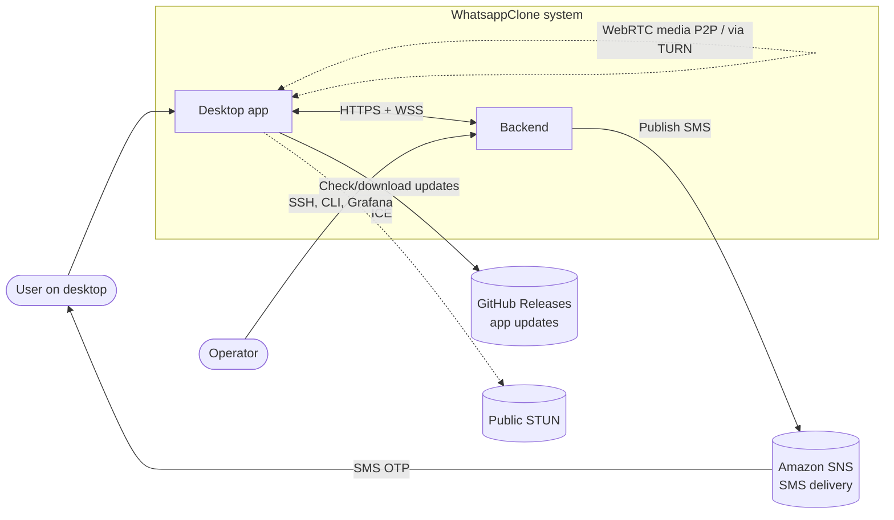
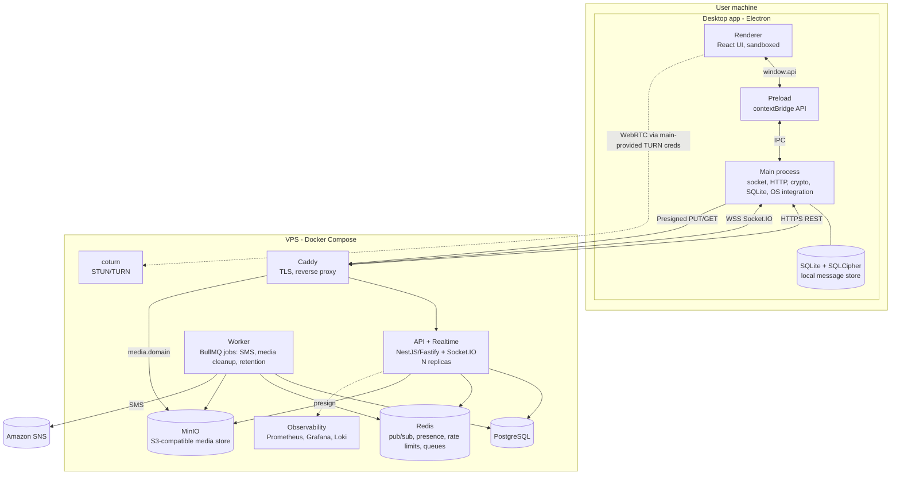
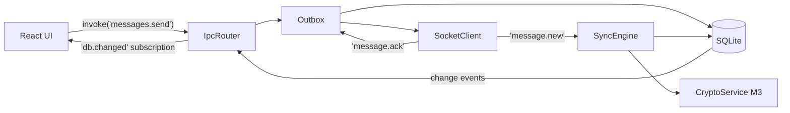
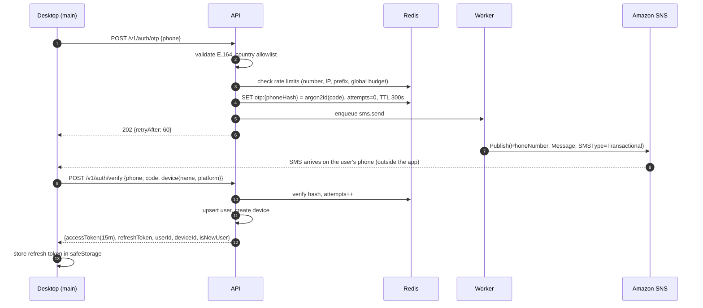
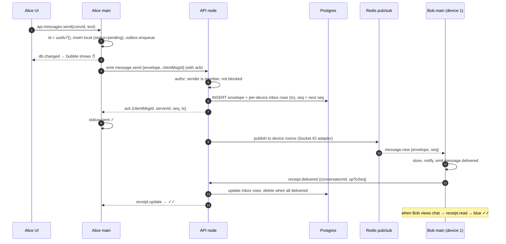

# 02 — Architecture: WhatsappClone

| | |
| --- | --- |
| Status | Draft v0.1 |
| Last updated | 2026-09-27 |
| Related | [Requirements](01-requirements.md) · [API & Protocol](04-api-protocol.md) · [Data Model](05-data-model.md) · [Security](06-security.md) · [ADRs](adr/) |

This document follows the [C4 model](https://c4model.com/): context → containers → components → key flows.

## 1. Architectural drivers

| Driver | Consequence |
| --- | --- |
| No lost or duplicated messages (G2, NFR-REL-02) | Durable write before ack, client-generated IDs, per-conversation `seq`, cursor-based resync |
| E2EE arrives in M3 without a rewrite (G3) | Envelope format and per-device fan-out from M1 ([ADR-0004](adr/0004-envelope-message-format.md)) |
| Cheap single-VPS start, can scale out later (G4) | Stateless API nodes, Redis for pub/sub and presence, Socket.IO Redis adapter, S3-compatible storage |
| Desktop security | Network, tokens and storage in the main process. The renderer is sandboxed UI only. |
| Small team | Mainstream stack (NestJS, Postgres, Redis, React), one language (TypeScript) end to end |

## 2. System context (C4 level 1)



## 3. Containers (C4 level 2)



| Container | Tech | Responsibility |
| --- | --- | --- |
| Desktop: renderer | React 19, TypeScript, Tailwind v4, Zustand, TanStack Query/Virtual, Radix UI primitives | UI only. WebRTC `RTCPeerConnection` (needs a web context). No Node, no tokens. |
| Desktop: preload | `contextBridge` | Exposes a narrow, typed `window.api` |
| Desktop: main | Electron main, `socket.io-client`, `undici`, `better-sqlite3-multiple-ciphers`, `safeStorage`, E2EE lib (M3) | Connectivity, sync engine, outbox, local DB, crypto, notifications, tray, updates |
| API + realtime | Node 24, NestJS 11 (Fastify adapter), Socket.IO 4 + `@socket.io/redis-adapter`, Drizzle ORM, zod, pino | Auth, REST, realtime routing, authorization, presigning |
| Worker | Same codebase, `worker` entrypoint, BullMQ | SMS sending, media GC, retention and deletion jobs, receipts aggregation |
| PostgreSQL 17 | | System of record: users, devices, conversations, memberships, envelopes, keys |
| Redis 7 (or Valkey 8) | | Socket.IO adapter, presence, typing, rate limiting, OTP store, BullMQ |
| MinIO | S3 API | Media and avatars. Any S3-compatible store can replace it (AWS S3, Cloudflare R2, Backblaze B2). |
| coturn | | STUN/TURN for calls, with time-limited credentials (TURN REST API) |
| Caddy 2 | | Automatic TLS (Let's Encrypt), HTTP/2 and 3, WebSocket proxying |

## 4. Desktop app components (C4 level 3)

### 4.1 Process model

```
Main process (Node)                             Renderer (Chromium, sandboxed)
├── AppLifecycle (single-instance lock, deep links wc://)   ├── App shell / router
├── WindowManager (main window, call window)   ├── Feature modules
├── SecurityPolicy (CSP, nav guards, perms)    │   ├── auth/  chats/  chat/  groups/
├── AuthService  (tokens in safeStorage)       │   ├── media/ calls/ settings/
├── ApiClient    (REST, refresh-on-401)        ├── State
├── SocketClient (connect, backoff, acks)      │   ├── Zustand: UI state (selection, drafts, theme)
├── SyncEngine   (cursor resync, inbox apply)  │   └── TanStack Query: data from window.api (cached)
├── Outbox       (durable queue, retries)      ├── Calls: WebRTC PeerConnection, media devices
├── Store        (SQLite repos + FTS5)         └── i18n, design system components
├── MediaService (encrypt/upload/download/cache)
├── CryptoService (M3: sessions, sender keys)
├── NotificationService, TrayService, BadgeService
├── UpdateService (electron-updater)
└── IpcRouter (typed handlers, zod-validated, sender-checked)
```

**Why is the network in main and not the renderer?**
1. The refresh token and E2EE private keys never enter a web context, so an XSS bug in the renderer cannot steal them.
2. Messages keep syncing and notifying while the window is closed (tray mode), even if the renderer is destroyed.
3. There is one connection even with multiple windows (the main window plus a pop-out call window).

**WebRTC exception:** `RTCPeerConnection` and `getUserMedia` only exist in the renderer. Signaling payloads
pass renderer ↔ main ↔ server through IPC. Main encrypts and decrypts them (M3+).

### 4.2 Data flow inside the client



The renderer is a **view over the local DB**. Every mutation goes to main. Main writes to SQLite and emits
change events. TanStack Query invalidates only the affected queries. This gives offline-first behaviour for
free: the UI never waits on the network to show local state.

### 4.3 Proposed folder structure (`desktop/`)

```
desktop/
├── electron.vite.config.ts
├── electron-builder.yml
├── src/
│   ├── main/
│   │   ├── index.ts                 # bootstrap
│   │   ├── app/                     # lifecycle, windows, tray, menu, deep links
│   │   ├── security/                # csp.ts, navigation.ts, permissions.ts, fuses
│   │   ├── ipc/                     # router.ts, handlers/*.ts (one file per domain)
│   │   ├── net/                     # api-client.ts, socket-client.ts, backoff.ts
│   │   ├── sync/                    # sync-engine.ts, outbox.ts, receipts.ts
│   │   ├── store/                   # db.ts, migrations/, repos/*.ts
│   │   ├── crypto/                  # (M3) session-store.ts, group-sessions.ts, safety-number.ts
│   │   ├── media/                   # upload.ts, download.ts, thumbnails.ts, cache.ts
│   │   └── services/                # notifications.ts, updates.ts, auth.ts, settings.ts
│   ├── preload/
│   │   └── index.ts                 # contextBridge.exposeInMainWorld('api', ...)
│   ├── renderer/
│   │   ├── index.html
│   │   └── src/
│   │       ├── app/                 # routes, providers, layout
│   │       ├── features/            # auth, chat-list, chat, group, media, calls, settings
│   │       ├── components/ui/       # design system (Button, Avatar, Bubble...)
│   │       ├── hooks/ lib/ i18n/ styles/
│   │       └── api.ts               # typed wrapper around window.api
│   └── shared/                      # types shared by main/preload/renderer (IPC contract)
├── e2e/                             # Playwright tests
└── resources/                       # icons, notification sounds
```

## 5. Server components

### 5.1 Modules (NestJS)

| Module | Responsibilities | Key dependencies |
| --- | --- | --- |
| `auth` | OTP request/verify, token issue/refresh/revoke, guards | Redis (OTP, limits), `sms` |
| `sms` | `SmsProvider` interface: `SnsSmsProvider`, `ConsoleSmsProvider`, `FakeSmsProvider` | AWS SDK v3 `@aws-sdk/client-sns` |
| `users` | Profile, privacy settings, blocking, contact lookup | Postgres |
| `devices` | Device registration, listing, revocation, push of `device.revoked` | Postgres, Redis |
| `conversations` | Direct/group lifecycle, membership, roles, invite links | Postgres |
| `messages` | Accept envelopes, assign `seq`, fan-out, store-and-forward, sync cursors, receipts | Postgres, Redis pub/sub |
| `media` | Presigned upload/download URLs, quotas, GC scheduling | MinIO/S3 |
| `keys` (M3) | Identity keys, signed prekeys, one-time prekey pools per device | Postgres |
| `calls` (M4) | Call signaling relay, call records, TURN credential minting | Redis |
| `presence` | Online/last-seen and typing (ephemeral) | Redis |
| `realtime` | Socket.IO gateway: auth handshake, rooms (`user:{id}`, `device:{id}`), event routing | Redis adapter |
| `admin` | Operator CLI commands (nest-commander) | All |
| `health` | `/healthz`, `/readyz`, `/metrics` | |

### 5.2 Proposed folder structure (`server/`)

```
server/
├── Dockerfile
├── docker-compose.dev.yml        # postgres, redis, minio, coturn
├── drizzle/                      # SQL migrations
├── src/
│   ├── main.ts                   # API entrypoint
│   ├── worker.ts                 # BullMQ worker entrypoint
│   ├── cli.ts                    # operator CLI
│   ├── config/                   # zod-validated env config
│   ├── common/                   # guards, interceptors, filters, logging, ids (uuidv7)
│   ├── db/                       # drizzle schema, client
│   └── modules/<module>/         # controller, gateway, service, repository, dto (from protocol)
└── test/
    ├── integration/              # Testcontainers
    └── e2e/                      # full API + socket flows
```

### 5.3 Scaling path

| Stage | Users (MAU) | Topology |
| --- | --- | --- |
| S0 | ≤ 5k | 1 VPS (4 vCPU / 8 GB): all containers, 2 API replicas |
| S1 | ≤ 50k | 2 app VPS behind a load balancer (sticky sessions not required with the WebSocket-only transport), managed Postgres, separate Redis, separate coturn per region |
| S2 | > 50k | K8s or Nomad. Partition message fan-out by conversation. Consider NATS/Kafka for fan-out. SFU for group calls. Read replicas. |

Socket.IO runs with `transports: ['websocket']` only. The desktop client always supports WebSocket, and this
avoids the sticky sessions that long-polling needs.

## 6. Key flows

### 6.1 Registration / login



The OTP is generated with `crypto.randomInt` and stored only as a hash. SNS is used only as a delivery
channel. See [ADR-0003](adr/0003-phone-otp-via-amazon-sns.md).

### 6.2 Send a message (online), with receipts



**Delivery guarantees**
- The server acks only after the Postgres transaction commits (NFR-REL-02).
- The client retries unacked outbox items with the same `clientMsgId`. A unique constraint on
  `(sender_device_id, client_msg_id)` makes retries idempotent, and the server returns the original ack.
- The server keeps a row in `device_inbox` for every recipient device until that device acks delivery.
  On reconnect, the client calls `sync.pull {cursor}` to fetch everything after its last cursor.

### 6.3 Reconnect & resync

1. The socket reconnects with backoff (1, 2, 4 … 30 s, ±20 % jitter). The handshake auth carries the access token.
2. The client sends `sync.pull {since: lastInboxCursor, limit: 500}` and repeats until `hasMore=false`.
3. Main applies the batch in one SQLite transaction and emits one `db.changed`.
4. The client acks delivery up to the last cursor.
5. The outbox flushes pending messages in creation order.

### 6.4 Media upload (M2; encrypted in M3)

1. Main reads the file, makes a thumbnail (images via `sharp`, video poster frame via renderer `<video>` capture) and computes SHA-256.
2. M3+: main generates a random 32-byte key, encrypts with AES-256-GCM in chunks, and uploads the ciphertext.
3. `POST /v1/media/uploads {size, mime, sha256}` returns `{mediaId, uploadUrl (presigned PUT, 15 min)}`.
   Files > 16 MB use multipart presigned URLs so uploads can resume.
4. The client PUTs to MinIO directly through Caddy on the `media.<domain>` host. A dedicated host keeps the
   presigned signature, which covers the Host header, valid. It then sends a message whose payload contains
   `{mediaId, mime, size, sha256, thumbnail(base64 ≤ 16 KB), [key, iv] (M3)}`.
5. Recipients call `GET /v1/media/{id}` → presigned GET (5 min), download, verify the hash, and decrypt (M3).

### 6.5 E2EE (M3) — overview

Full design: [Security §6](06-security.md#6-end-to-end-encryption-design-m3) and
[ADR-0005](adr/0005-e2ee-library-choice.md).

- Every device publishes an identity key, a signed prekey and 100 one-time prekeys.
- 1:1: the sender fetches the recipient's (and their own other devices') prekey bundles, establishes
  pairwise sessions (X3DH/Olm style), then uses the Double Ratchet. One envelope carries N per-device ciphertexts.
- Groups: each sender device creates a **sender key** (Megolm style), distributes it over pairwise sessions,
  and encrypts each group message once. Keys rotate when members leave or are removed.
- The server sees: sender device, recipient devices, conversation ID, size, time. It never sees content.

### 6.6 Call setup (M4)

```mermaid
sequenceDiagram
    participant A as Alice renderer
    participant AM as Alice main
    participant S as Server (calls)
    participant BM as Bob main (all devices)
    participant B as Bob renderer
    AM->>S: GET /v1/calls/turn-credentials
    S-->>AM: {urls, username(expiry:userId), credential(HMAC), ttl}
    A->>A: getUserMedia, createOffer
    A->>AM: api.calls.start(convId, offer)
    AM->>S: call.offer (E2EE sealed SDP)
    S->>BM: call.offer → ring on all devices
    B->>BM: accept, createAnswer
    BM->>S: call.answer
    S->>AM: call.answer ; S->>BM(other devices): call.answered-elsewhere
    A-->>B: ICE candidates via call.ice (trickle)
    A<-->>B: DTLS-SRTP media (P2P or via coturn relay)
```

## 7. Cross-cutting concerns

| Concern | Approach |
| --- | --- |
| Configuration | Server: zod-validated env (`src/config`); the server fails fast on invalid config. Desktop: the build-time `API_BASE_URL` can be overridden with a dev-only flag. |
| IDs | UUIDv7 everywhere (sortable, generated on the client for messages). |
| Time | Server timestamps in UTC (`timestamptz`). The client shows local time. Ordering uses `seq`, not clocks. |
| Errors | RFC 9457 Problem Details for REST. Socket acks use `{ok:false, error:{code, message}}`. Codes are listed in [04 §5](04-api-protocol.md#5-error-model). |
| Logging | pino JSON with `reqId`/`traceId` and PII redaction paths. The desktop logs to a rotating file (`electron-log`) with a "Export diagnostics" button. |
| Observability | OpenTelemetry → Prometheus (metrics) and Tempo (traces, optional). Loki for logs. Sentry (self-hosted or SaaS) for crash reports, opt-in on desktop. |
| Feature flags | Server-driven `/v1/config` (for example `e2ee.enabled`, `calls.enabled`) so features can roll out gradually. |
| Versioning | The protocol has `major.minor`. The socket handshake sends `protocolVersion` and `appVersion`, and the server rejects unsupported versions with `CLIENT_UPGRADE_REQUIRED`. |
| i18n | `i18next` in the renderer. All strings are keys from day one. |

## 8. Technology choices (summary)

| Decision | Choice | ADR |
| --- | --- | --- |
| Record decisions | Markdown ADRs (Nygard format) | [0001](adr/0001-record-architecture-decisions.md) |
| Server framework & realtime | NestJS + Fastify + Socket.IO + Redis adapter | [0002](adr/0002-server-stack-nestjs-socketio.md) |
| Phone verification | Server-generated OTP, delivered through Amazon SNS | [0003](adr/0003-phone-otp-via-amazon-sns.md) |
| Message model | Envelope + per-device fan-out + per-conversation `seq` | [0004](adr/0004-envelope-message-format.md) |
| E2EE implementation | vodozemac (Olm/Megolm) via WASM, proposed | [0005](adr/0005-e2ee-library-choice.md) |
| Client local store | SQLite + SQLCipher in main process | [0006](adr/0006-client-local-store-sqlite.md) |
| Media storage | S3-compatible (MinIO) + presigned URLs | [0007](adr/0007-media-storage-presigned-s3.md) |
| Calls | WebRTC P2P mesh (≤ 4) + coturn; SFU later | [0008](adr/0008-calls-webrtc-mesh-coturn.md) |

## 9. Risks

| Risk | Likelihood | Impact | Mitigation |
| --- | --- | --- | --- |
| E2EE complexity delays M3 | High | High | Envelope format from M1. Spike in M2. Use an audited library rather than writing our own crypto. |
| SMS toll fraud (SMS pumping) drains budget | Medium | High | Country allowlist, multi-level rate limits, SNS spend cap, CAPTCHA after anomalies ([Security §7](06-security.md#7-abuse--fraud-prevention)) |
| Native module (SQLCipher) build issues across OS/arch | Medium | Medium | Prebuilt binaries, CI matrix incl. arm64, `@electron/rebuild` |
| TURN bandwidth cost | Medium | Medium | Prefer P2P, cap TURN bandwidth per allocation, monitor |
| Single VPS is a single point of failure | High | Medium | Documented restore runbook, offsite backups, scale-out path S1 |
| Trademark claims over the name/look | Medium | High | Rename before release. Use our own brand colors and icons (see [UI/UX §2](03-ui-ux-design.md#2-brand--visual-language)). |
