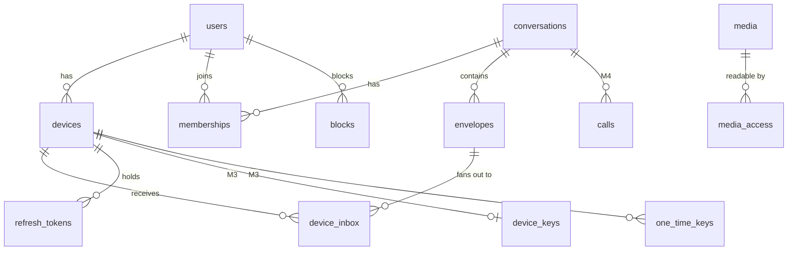

# 05 — Data Model: WhatsappClone

| | |
| --- | --- |
| Status | Draft v0.1 |
| Last updated | 2026-09-27 |
| Source of truth | Server: `server/src/db/schema.ts` (Drizzle) + `server/drizzle/*.sql`. Client: `desktop/src/main/store/migrations/*.sql`. |

## 1. Server (PostgreSQL 17)

### 1.1 Entity-relationship overview



### 1.2 Tables

> Types are PostgreSQL. `id uuid` values are UUIDv7 generated by the application. All tables have
> `created_at timestamptz not null default now()`. Tables that are updated also have `updated_at`.

**users**

| Column | Type | Notes |
| --- | --- | --- |
| id | uuid PK | |
| phone_e164 | text UNIQUE NOT NULL | Plaintext, because lookup needs it. Protected by volume encryption and DB access controls. |
| phone_hash | bytea UNIQUE | HMAC-SHA256(phone, server pepper). Used as the key in Redis and logs. |
| display_name | text NOT NULL | 1–25 chars |
| about | text | ≤ 139 chars |
| avatar_media_id | uuid FK media NULL | |
| privacy | jsonb NOT NULL | `{lastSeen, profilePhoto, about, readReceipts}` |
| pin_hash | text NULL | argon2id (FR-AUTH-09) |
| status | text NOT NULL | `active` \| `banned` \| `pending_deletion` |
| deletion_requested_at | timestamptz NULL | |
| last_seen_at | timestamptz NULL | Written on disconnect (presence lives in Redis) |

**devices**

| Column | Type | Notes |
| --- | --- | --- |
| id | uuid PK | |
| user_id | uuid FK users ON DELETE CASCADE | |
| name | text | e.g. "Amina's MacBook" |
| platform | text | `win32` \| `darwin` \| `linux` |
| app_version | text | |
| last_active_at | timestamptz | |
| revoked_at | timestamptz NULL | Index: `(user_id) WHERE revoked_at IS NULL` |

**refresh_tokens**

| Column | Type | Notes |
| --- | --- | --- |
| id | uuid PK | |
| device_id | uuid FK devices | |
| family_id | uuid | Rotation family (reuse detection revokes the family) |
| token_hash | bytea UNIQUE | SHA-256 of an opaque 256-bit token |
| expires_at | timestamptz | Idle 60 days |
| used_at / revoked_at | timestamptz NULL | |

**conversations**

| Column | Type | Notes |
| --- | --- | --- |
| id | uuid PK | |
| type | text | `direct` \| `group` |
| direct_key | text UNIQUE NULL | `min(userA,userB):max(...)`. Makes direct chats unique. |
| name, description | text NULL | groups |
| icon_media_id | uuid NULL | |
| settings | jsonb | `{onlyAdminsEdit, onlyAdminsSend}` |
| last_seq | bigint NOT NULL default 0 | Incremented under a row lock per message |
| e2ee | boolean NOT NULL default false | Set to true when migrated or created after M3 |
| invite_code | text UNIQUE NULL | |

**memberships**

| Column | Type | Notes |
| --- | --- | --- |
| conversation_id, user_id | PK (composite) | |
| role | text | `owner` \| `admin` \| `member` |
| joined_seq | bigint | The member can see messages with `seq > joined_seq` |
| left_at | timestamptz NULL | |
| mute_until, archived, pinned, disappearing_sec | per-user settings | |
| last_read_seq, last_delivered_seq | bigint | Aggregated receipts per user |

**envelopes**

| Column | Type | Notes |
| --- | --- | --- |
| id | uuid PK | serverId |
| conversation_id | uuid FK | |
| seq | bigint | UNIQUE `(conversation_id, seq)` |
| sender_user_id, sender_device_id | uuid | |
| client_msg_id | uuid | UNIQUE `(sender_device_id, client_msg_id)` for idempotency |
| kind | text | message/edit/delete/reaction/system |
| payload | bytea | Serialized envelope payload (plaintext JSON before M3, ciphertext blob after). Max 128 KB. |
| expires_at | timestamptz NULL | Disappearing messages / store-and-forward TTL |
| deleted_at | timestamptz NULL | Delete-for-everyone tombstone |

Partitioning: `envelopes` uses **range partitions by month** on `created_at` (pg_partman), so retention is
a cheap partition drop.

**device_inbox** (store-and-forward queue per recipient device)

| Column | Type | Notes |
| --- | --- | --- |
| device_id | uuid | PK part 1 |
| cursor | bigint GENERATED ALWAYS AS IDENTITY | PK part 2. Monotonic per table. The client's sync cursor. |
| envelope_id | uuid FK envelopes | |
| per_device_payload | bytea NULL | M3: the per-device ciphertext for `olm` envelopes. NULL = use envelope.payload. |
| delivered_at | timestamptz NULL | Rows are deleted by a worker 24 h after delivery |

Index: `(device_id, cursor) WHERE delivered_at IS NULL`.

**Retention:**
- **M1–M2:** envelopes are kept as the server-side history (FR-MSG-18), except deleted ones. Default
  retention is unlimited and operator-configurable (`MESSAGE_RETENTION_DAYS`).
- **M3+ (E2EE chats):** envelopes are deleted once every recipient device has delivered them, or after 30
  days (`INBOX_TTL_DAYS`), whichever comes first. The server holds no history.

**media**

| Column | Type | Notes |
| --- | --- | --- |
| id | uuid PK | |
| owner_user_id | uuid | |
| object_key | text | `m/{yyyy}/{mm}/{id}` |
| size_bytes | bigint | |
| mime | text | Declared (and verified before M3) |
| sha256 | bytea | Of the uploaded bytes (ciphertext in M3) |
| purpose | text | message/avatar/group-icon |
| status | text | `pending` \| `ready` \| `deleted` |
| expires_at | timestamptz NULL | 30 days after the last recipient download (FR-MED-09) |

**media_access**: `(media_id, conversation_id)`. It grants download to members of the conversation the
media was sent in. The server records this when the message referencing `mediaId` is sent (before M3 by
parsing the payload; in M3 the client declares `mediaIds[]` in the envelope header).

**blocks**: `(blocker_id, blocked_id)` PK.

**reports**: `id, reporter_id, target_user_id, conversation_id, messages jsonb, reason, status, created_at`.

**device_keys (M3)**: `device_id PK, identity_key bytea, signed_prekey_id int, signed_prekey bytea, signature bytea, updated_at`.

**one_time_keys (M3)**: `device_id, key_id` PK, `public_key bytea`, `claimed_at NULL`.

**calls (M4)**: `id, conversation_id, initiator_user_id, type (voice|video), started_at, answered_at, ended_at, end_reason`.

**audit_log**: `id, actor (user/device/operator), action, target, ip_hash, created_at`. Kept 1 year. Covers
logins, device changes, bans and deletions.

## 2. Redis keyspace

| Key | Type | TTL | Purpose |
| --- | --- | --- | --- |
| `otp:{phoneHash}` | hash `{codeHash, attempts}` | 300 s | OTP verification |
| `rl:otp:num:{phoneHash}` / `rl:otp:ip:{ip}` / `rl:otp:prefix:{cc+3}` | sliding window counters | window | SMS rate limits |
| `sms:budget:{yyyymmdd}` | counter | 48 h | Daily SMS spend guard |
| `rl:api:{userId}:{bucket}` | token bucket | window | API rate limits |
| `presence:{userId}` | hash `{online, devices}` | 90 s (refreshed by heartbeat) | Presence |
| `typing:{convId}:{userId}` | string | 6 s | Typing state (optional; mostly relayed only) |
| `sio:*` | — | — | Socket.IO Redis adapter |
| `bull:*` | — | — | BullMQ queues: `sms`, `media-gc`, `retention`, `receipts`, `account-deletion` |
| `idem:{userId}:{key}` | string (response) | 24 h | REST idempotency |

## 3. Desktop client (SQLite + SQLCipher)

One database per account profile: `<userData>/profiles/<profile>/db.sqlite`. It is encrypted with a
random 256-bit key. The key is wrapped with Electron `safeStorage` and stored in `<userData>/profiles/<profile>/key.bin`.
WAL mode is on.

```sql
CREATE TABLE meta            (key TEXT PRIMARY KEY, value TEXT NOT NULL);           -- schema_version, inbox_cursor, user_id, device_id
CREATE TABLE contacts        (user_id TEXT PRIMARY KEY, phone TEXT, saved_name TEXT, display_name TEXT,
                              about TEXT, avatar_path TEXT, blocked INTEGER DEFAULT 0, verified INTEGER DEFAULT 0,
                              identity_key BLOB, updated_at INTEGER);
CREATE TABLE conversations   (id TEXT PRIMARY KEY, type TEXT, name TEXT, icon_path TEXT, last_seq INTEGER,
                              last_message_id TEXT, unread_count INTEGER DEFAULT 0, mute_until INTEGER,
                              archived INTEGER, pinned_at INTEGER, disappearing_sec INTEGER, draft TEXT,
                              e2ee INTEGER DEFAULT 0, updated_at INTEGER);
CREATE TABLE members         (conversation_id TEXT, user_id TEXT, role TEXT, PRIMARY KEY (conversation_id, user_id));
CREATE TABLE messages        (id TEXT PRIMARY KEY,            -- clientMsgId (own) or serverId (others)
                              server_id TEXT UNIQUE, conversation_id TEXT NOT NULL, seq INTEGER,
                              sender_id TEXT, kind TEXT, body_json TEXT, reply_to TEXT,
                              status TEXT,                     -- pending|sent|delivered|read|failed
                              sent_at INTEGER, edited_at INTEGER, deleted INTEGER DEFAULT 0,
                              expires_at INTEGER, starred INTEGER DEFAULT 0);
CREATE INDEX messages_conv_seq ON messages(conversation_id, seq);
CREATE VIRTUAL TABLE messages_fts USING fts5(text, content='messages', content_rowid='rowid', tokenize='unicode61 remove_diacritics 2');
CREATE TABLE reactions       (message_id TEXT, user_id TEXT, emoji TEXT, PRIMARY KEY (message_id, user_id));
CREATE TABLE receipts        (message_id TEXT, user_id TEXT, delivered_at INTEGER, read_at INTEGER, PRIMARY KEY (message_id, user_id));
CREATE TABLE attachments     (id TEXT PRIMARY KEY, message_id TEXT, media_id TEXT, mime TEXT, size INTEGER,
                              sha256 BLOB, key BLOB, iv BLOB, local_path TEXT, thumb BLOB,
                              state TEXT);                     -- remote|downloading|local|failed
CREATE TABLE outbox          (id TEXT PRIMARY KEY, conversation_id TEXT, envelope_json TEXT, attempts INTEGER,
                              next_attempt_at INTEGER, created_at INTEGER);
CREATE TABLE calls           (id TEXT PRIMARY KEY, conversation_id TEXT, direction TEXT, type TEXT,
                              started_at INTEGER, duration_ms INTEGER, status TEXT);
-- M3: crypto state (pickled, itself encrypted by SQLCipher)
CREATE TABLE crypto_account  (id INTEGER PRIMARY KEY CHECK (id = 1), pickle BLOB);
CREATE TABLE crypto_sessions (device_id TEXT, session_id TEXT, pickle BLOB, last_used INTEGER, PRIMARY KEY (device_id, session_id));
CREATE TABLE group_sessions  (conversation_id TEXT, sender_device_id TEXT, session_id TEXT, pickle BLOB,
                              outbound INTEGER, created_at INTEGER, PRIMARY KEY (conversation_id, sender_device_id, session_id));
```

Media files live in `<userData>/profiles/<profile>/media/<yyyy-mm>/<mediaId>`. They are stored decrypted
only for display. From M3 they are kept encrypted at rest with the per-file key, and decrypted to a
temporary file only when the user opens them externally.

### 3.1 Migrations

- Server: `drizzle-kit generate` produces SQL migrations. They are reviewed in PR and applied by
  `pnpm db:migrate` in a pre-deploy job. **Expand/contract** pattern: never drop a column in the same release
  that stops using it.
- Client: numbered SQL files, applied at startup inside a transaction. `meta.schema_version` records the
  state. A failing migration restores the automatic pre-migration copy (`db.sqlite.bak`).

## 4. Data lifecycle & privacy

| Data | Where | Retention | Deletion |
| --- | --- | --- | --- |
| Phone, profile | Server | Account lifetime | Purged ≤ 30 days after account deletion |
| Messages (pre-E2EE) | Server + clients | Operator-defined | Delete-for-everyone tombstones. Account deletion removes the user's authored messages. |
| Messages (E2EE) | Clients only (server until delivered, ≤ 30 d) | — | Local deletion |
| Media | S3 until expiry (30 d after last download), clients | — | GC worker |
| Logs | Loki | 14 days | Automatic |
| Audit log | Postgres | 1 year | Automatic |
| Backups | Offsite object storage | 30 days | Automatic lifecycle rule |

Data export (NFR-SEC-08): `GET /me/export` produces a JSON archive of the profile, devices, conversations
metadata and (pre-E2EE) the user's messages, generated asynchronously by the worker.
