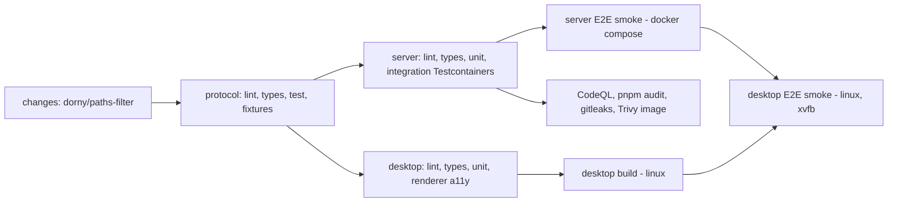

# 08 — CI/CD & Release: WhatsappClone

| | |
| --- | --- |
| Status | Draft v0.1 |
| Last updated | 2026-09-27 |

## 1. Branching & versioning

- Trunk-based: short-lived branches → PR → squash-merge to `main`. `main` must always be releasable.
- **SemVer.** Desktop and server share a product version `X.Y.Z`, released together through
  [release-please](https://github.com/googleapis/release-please) in manifest mode, with the
  `whatsapp-clone` component scoped to `whatsapp-clone/**`. The protocol has its own `major.minor`
  ([04 §6](04-api-protocol.md#6-compatibility-policy)).
- Tags: `whatsapp-clone-v1.4.0`. Pre-releases: `-beta.N` go to the beta update channel.
- Conventional Commit types drive the version bump (`feat` → minor, `fix` → patch, `!`/`BREAKING CHANGE` → major).

## 2. Pipelines (GitHub Actions)

All workflows live in the repo root `.github/workflows/` and use `paths:` filters so only
`whatsapp-clone/**` changes trigger them.

### 2.1 `whatsapp-ci.yml` (on PR and push to main)

- Node 24, `pnpm/action-setup`, `actions/setup-node` with pnpm cache.
- Concurrency group per ref, cancelling in-progress runs on new pushes.
- Required checks for merging: every job above.

### 2.2 `whatsapp-nightly.yml` (cron)

Full server E2E, desktop E2E on `windows-latest`, `macos-latest` and `ubuntu-latest`, visual regression,
k6 load test against an ephemeral stack, chaos tests, and ZAP baseline against staging. Failures open an
issue automatically.

### 2.3 `whatsapp-release.yml` (on release-please tag)

| Job | Runner | Steps |
| --- | --- | --- |
| `server-image` | ubuntu | Build multi-arch image (amd64/arm64) with Buildx → Trivy → push to `ghcr.io/george-kibe/whatsapp-clone-server:{version, sha}` → cosign keyless sign (OIDC) → SBOM (Syft) |
| `desktop-win` | windows-latest | `pnpm build` → electron-builder NSIS x64 + arm64 → sign with **Azure Artifact Signing** (formerly Trusted Signing) → upload |
| `desktop-mac` | macos-latest | Build universal or separate x64/arm64 DMG + ZIP → sign with Developer ID Application (hardened runtime, entitlements for mic/camera) → notarize with `notarytool` (App Store Connect API key) → staple |
| `desktop-linux` | ubuntu | AppImage, deb, rpm (x64, arm64) |
| `publish` | ubuntu | Create the GitHub Release (draft) with artifacts, `latest*.yml` update manifests, SBOMs and checksums. A human reviews it and publishes. |
| `deploy-staging` | ubuntu (environment `staging`) | SSH deploy of the new image to staging → smoke tests |
| `deploy-production` | ubuntu (environment `production`, manual approval) | Run migrations → rolling deploy → smoke → post a release note |

### 2.4 Secrets & environments

| GitHub environment | Secrets | Protection |
| --- | --- | --- |
| `release` | `AZURE_*` (Artifact Signing via OIDC federated credential), `APPLE_API_KEY`, `APPLE_API_KEY_ID`, `APPLE_API_ISSUER`, `CSC_LINK` / `CSC_KEY_PASSWORD` (Developer ID .p12) | Tag pushes only, 1 reviewer |
| `staging` | `STAGING_SSH_KEY`, `STAGING_HOST` | — |
| `production` | `PROD_SSH_KEY`, `PROD_HOST` | Manual approval, `main` only |

## 3. Code signing & notarization

| OS | Requirement | Notes |
| --- | --- | --- |
| Windows | Authenticode signature | Without it, SmartScreen warns "Unknown publisher". Azure Artifact Signing is the cheapest option (~US$10/month) and builds reputation. Alternatively, an OV/EV certificate on a cloud HSM. |
| macOS | Developer ID + notarization + stapling | Requires an Apple Developer Program membership (US$99/year). Entitlements: `com.apple.security.device.audio-input`, `com.apple.security.device.camera`, plus `NSMicrophoneUsageDescription` and `NSCameraUsageDescription` in Info.plist. |
| Linux | Optional GPG signature for deb/rpm repos | AppImage can embed a signature. Checksums are published. |

## 4. Auto-update

- `electron-updater` with the GitHub provider (public repo) or a generic provider (`https://updates.<domain>/`) if the repo is private.
- Channels: `latest` (stable) and `beta` (opt-in in Settings → About).
- Flow: check at startup + every 4 h → download in the background → notification "Update ready: restart
  now / later" → `quitAndInstall` on accept or at next quit.
- Staged rollout: `stagingPercentage` in `latest.yml`, going 10 % → 50 % → 100 % over 72 h. Stop the rollout
  if the crash-free rate drops.
- **Server compatibility:** the server's `minClientVersion` only moves forward after ≥ 90 % of active
  clients are on a compatible version (a Grafana panel tracks versions from the socket handshake).
- Linux: AppImage self-updates. deb/rpm users are told to update through their package manager (future apt/rpm repo).

## 5. Server deployment

See [09 — Deployment & Operations](09-deployment-operations.md). In short: the image is pinned by digest,
`docker compose pull && docker compose up -d --no-deps --scale api=2` runs as a rolling update, migrations
run first as a one-off container, and health checks gate traffic through Caddy.

## 6. Release checklist

1. The release-please PR is up to date. CHANGELOG has been reviewed.
2. CI and nightly are green on the release commit.
3. Merge the release PR → tag → release workflow.
4. Download and smoke-test the signed artifacts on each OS (see [07 §8](07-testing-strategy.md#8-release-qa-checklist-manual-per-release-each-os)).
5. Deploy the server to staging → run desktop against staging → deploy to production.
6. Publish the GitHub Release (starts auto-update at 10 %).
7. Watch crash reports and metrics for 24 h, then widen the rollout.
8. Rollback plan: unpublish the release / set `stagingPercentage: 0`. Server: redeploy the previous image
   digest. Migrations are backward compatible (expand/contract).
