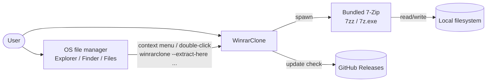
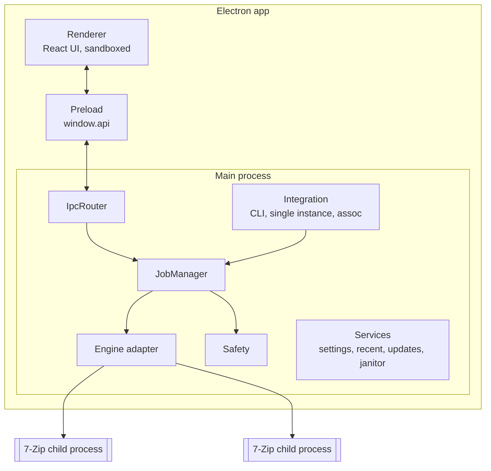
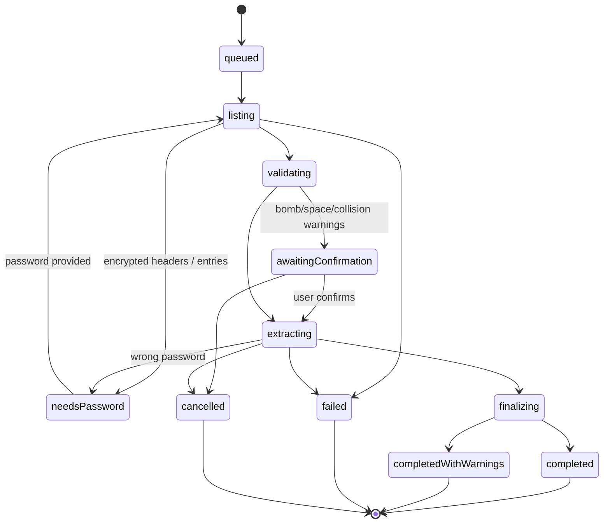
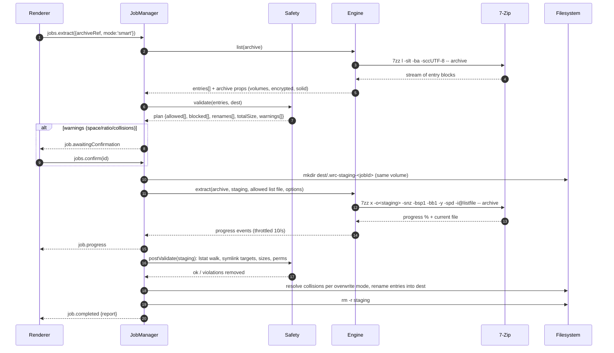

# 02 — Architecture: WinrarClone

| | |
| --- | --- |
| Status | Draft v0.1 |
| Last updated | 2026-09-27 |
| Related | [Requirements](01-requirements.md) · [IPC & Engine Contract](04-ipc-engine-contract.md) · [Security](06-security.md) · [ADRs](adr/) |

## 1. Architectural drivers

| Driver | Consequence |
| --- | --- |
| Broad format support incl. RAR5 (G1) | Bundle the official 7-Zip binary ([ADR-0002](adr/0002-bundled-7zip-engine.md)) |
| Safety against hostile archives (G3) | List → validate → stage → post-validate → move pipeline ([ADR-0003](adr/0003-staged-extraction-pipeline.md)) |
| Responsive UI with huge archives | Streamed parsing in main, virtualized lists, paged IPC |
| OS integration via context menus | Single-instance app with a CLI entry that forwards and batches requests ([ADR-0005](adr/0005-single-instance-cli-forwarding.md)) |
| Security of the Electron shell | Sandboxed renderer. All filesystem and process access in main. |

## 2. System context



No backend. The only network traffic is the update check.

## 3. Containers / processes



| Part | Responsibility |
| --- | --- |
| **Renderer** | Archive browser, dialogs, job queue UI, settings. Holds no paths other than those main returns for display. |
| **Preload** | Typed `window.api`: `archive.open`, `archive.list(page)`, `jobs.*`, `settings.*`, `dialog.*`, `events.on(...)` |
| **IpcRouter** | Sender check + zod validation for every channel |
| **JobManager** | FIFO queue with concurrency (default 2; 1 for jobs on the same physical disk), job state machine, progress aggregation, cancellation, taskbar progress, notifications |
| **Engine adapter** | Resolves the binary path for platform/arch, builds argv, spawns, parses stdout/stderr as streams, maps exit codes → typed errors, answers password prompts |
| **Safety** | Path validation, name sanitization, symlink policy, bomb guard, free-space checks, MotW, permission stripping |
| **Integration** | Parses `process.argv` and `second-instance` argv, batches invocations (500 ms window), `open-file` (macOS), registers and unregisters context menus (Linux/macOS helpers, Windows via installer + runtime toggle) |
| **Services** | Settings (electron-store + zod), recent archives, electron-updater, temp/staging janitor, logging (electron-log) |

### 3.1 Why 7-Zip runs as a child process (not N-API/WASM)

See [ADR-0002](adr/0002-bundled-7zip-engine.md). In short: full format coverage including RAR5 and
multi-volume, native speed, crash isolation (a hostile archive that crashes the decoder kills only the
child), easy updates (swap the binary), and no need to link LGPL code into our binary.

## 4. Job pipeline

### 4.1 Job state machine



### 4.2 Extraction flow (detailed)



Notes:
- `-spd` turns off wildcard matching so file names containing `*`/`?` are literal. `-i@listfile` (a UTF-8
  list file in the temp dir) selects only allowed entries. Because blocked entries are never passed to 7-Zip,
  path traversal is prevented **before** extraction, and post-validation catches anything 7-Zip itself might
  have produced (defence in depth).
- The staging dir is on the destination volume, so the final move is a cheap `rename`. If rename fails
  across devices, it falls back to copy + delete.
- Smart mode: after listing, if every allowed entry shares one top-level folder, the final destination is
  the archive's parent. Otherwise it is `<parent>/<archiveBaseName>/` (with a unique suffix if that exists).

### 4.3 Create flow

1. The UI sends sources (refs from dialog/drop/CLI) and options.
2. Safety checks: sources exist and are readable, the output path is not inside the sources, and free space
   is at least the estimated size.
3. The engine writes `<out>.wrc-partial`, then renames it to `<out>` on success. On failure or cancel it
   deletes the partial file and any `.001…` volumes.
4. The TAR.GZ/XZ/BZ2 pipeline runs two 7-Zip processes piped together:
   `7zz a -ttar -so -- sources | 7zz a -si -tgzip -- out.tar.gz`.

### 4.4 Browse & preview

- Listing is parsed in streaming fashion and stored in an in-memory **archive index** in main: a flat array
  of entries plus a folder tree built from normalized paths. The renderer asks for pages
  (`archive.list({folder, sort, offset, limit})`), so the full listing never crosses IPC at once.
- Preview extracts a single entry to stdout (`7zz e -so -- archive entryPath`), capped at the preview limit,
  into a temp file in a private temp dir (`0700`). The renderer receives a `wrc-preview://<token>` URL
  served by a custom protocol handler that serves only that file.
- Drag-out: extract the selected entries to temp first (with progress), then `webContents.startDrag({ files })`.

## 5. Proposed folder structure (`app/`)

```
app/
├── electron.vite.config.ts
├── electron-builder.yml
├── scripts/
│   ├── 7zip-versions.json          # version, URLs, SHA-256 per platform/arch
│   ├── fetch-7zip.ts               # download + verify + extract into vendor/
│   └── make-fixtures.ts            # build test archive corpus
├── build/
│   ├── installer.nsh               # context-menu registry keys (HKCU), uninstall cleanup
│   ├── entitlements.mac.plist
│   └── linux/                      # .desktop template, Nautilus/Dolphin/Nemo action templates
├── src/
│   ├── main/
│   │   ├── index.ts
│   │   ├── engine/ (binary.ts, args.ts, spawn.ts, parsers/{list,progress,errors}.ts, errors.ts)
│   │   ├── jobs/   (job-manager.ts, job.ts, extract-job.ts, create-job.ts, test-job.ts)
│   │   ├── safety/ (paths.ts, names.ts, symlinks.ts, bomb-guard.ts, disk.ts, motw.ts, perms.ts)
│   │   ├── integration/ (cli.ts, single-instance.ts, open-file.ts, context-menu/{win,mac,linux}.ts)
│   │   ├── ipc/    (router.ts, handlers/*.ts)
│   │   ├── security/ (csp.ts, navigation.ts, protocols.ts)
│   │   └── services/ (settings.ts, recent.ts, updater.ts, janitor.ts, logger.ts)
│   ├── preload/index.ts
│   ├── renderer/src/ (app/, features/{browser,jobs,create,settings,about}, components/ui/, i18n/)
│   └── shared/ (ipc-contract.ts, schemas.ts, types.ts)
├── test/fixtures/
└── e2e/
```

## 6. Cross-cutting concerns

| Concern | Approach |
| --- | --- |
| Paths | Main works internally with absolute, normalized paths (`path.resolve` + `realpath` for destinations). The renderer gets opaque `ref` IDs plus display strings. |
| Encoding | `-sccUTF-8` for console I/O. On Windows, the argv list file is UTF-8 with `-scsUTF-8`. For legacy ZIPs, an optional `-mcp=<codepage>` override. |
| Errors | Typed `EngineError` codes (`WRONG_PASSWORD`, `MISSING_VOLUME`, `CRC_ERROR`, `UNSUPPORTED_METHOD`, `DISK_FULL`, `ACCESS_DENIED`, `CORRUPT_ARCHIVE`, `NOT_ARCHIVE`, `CANCELLED`, `UNKNOWN`) mapped from exit code + stderr patterns, with a user-facing message key |
| Logging | electron-log to a rotating file. File names are logged at `debug` level only, and are off by default. Passwords are never logged. |
| Settings | electron-store with a zod schema + migrations |
| Updates | electron-updater (GitHub Releases), signed |
| Performance | Progress events are throttled. Listing is parsed by a line-oriented streaming parser. Large listings are indexed off the main event loop in chunks (`setImmediate`), or in a `worker_threads` worker if > 200k entries. |

## 7. Technology choices

| Decision | Choice | ADR |
| --- | --- | --- |
| Decision records | Markdown ADRs | [0001](adr/0001-record-architecture-decisions.md) |
| Engine | Bundled official 7-Zip CLI (≥ 25.01) | [0002](adr/0002-bundled-7zip-engine.md) |
| Extraction safety | List → validate → stage → post-validate → move | [0003](adr/0003-staged-extraction-pipeline.md) |
| App stack | Electron + electron-vite + React + TS + Tailwind | [0004](adr/0004-app-stack-electron-react.md) |
| Invocation model | Single instance + CLI forwarding + batching | [0005](adr/0005-single-instance-cli-forwarding.md) |
| No RAR creation | Extract-only for RAR | [0006](adr/0006-no-rar-creation.md) |

## 8. Risks

| Risk | Mitigation |
| --- | --- |
| 7-Zip CLI output changes between versions | Pin the version. Fixture-based parser tests per OS. Upgrade checklist. |
| 7-Zip vulnerability in the decoder | Fast update policy (NFR-SEC-02). Child-process isolation. Future: run 7-Zip in a restricted token / sandbox profile ([Security §6](06-security.md#6-future-hardening)). |
| Antivirus false positives on bundled `7z.exe` | Use the official signed binaries. Sign our installer. Submit to Microsoft Defender if flagged. |
| Windows 11 modern context menu not reachable | Classic menu in v1. Sparse package + `IExplorerCommand` DLL in the future. |
| macOS Gatekeeper blocks the nested binary | Sign `7zz` with our Developer ID inside the app bundle (hardened runtime) before notarization |
